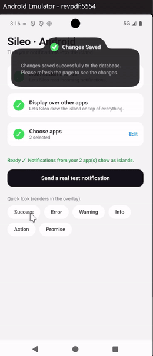

<div align="center">

# Sileo · Android

An Android port of **[Sileo](https://sileo.aaryan.design)** — the opinionated,
physics-based "Dynamic Island"–style toast by
**[Aaryan](https://github.com/hiaaryan/sileo)**.

Sileo is a React component (SVG morphing + spring physics). This project recreates
that look **natively in Kotlin + Jetpack Compose**, and then takes it further:
turning it into a real **notification island** that floats over any app.



▶️ **[Watch the full demo (with audio)](https://github.com/bikash1376/sileo-android/raw/main/app/public/demo.mp4)**

</div>

---

## What it is

A black, rounded **pill** that springs open into a wider **body** and back, with the
two shapes fused by a liquid "gooey" join — just like the original Sileo. It comes in
the same variants: **success · error · warning · info · action · promise**.

There are two flavors, on two branches:

| Branch | What it is |
|--------|------------|
| **`main`** | The **island component + a playground**. A standalone app with buttons that fire each variant so you can see/tune the look. No special permissions. |
| **`listener`** | The **real notification island**. Reads your actual notifications and shows them as the island over any app, with a per-app picker. |

---

## How it works

**The island (both branches).** The "goo" is reproduced with Android's
[`RenderEffect`](https://developer.android.com/reference/android/graphics/RenderEffect):
a **blur** chained with an **alpha-threshold color matrix** — the exact blur-then-snap
trick the web version does with its SVG filter. Two rounded rectangles (a narrow pill
+ a wider body) are drawn into that layer, and the blur fuses them into a smooth
concave neck. The open/close morph is a Compose **`spring`** tuned to match
framer-motion's feel. The body is revealed with a custom `layout` so its measured
height always matches what's drawn (no text clipping).

**The notification island (`listener` branch).** On a normal (non-rooted) phone you
**can't replace** Android's notification renderer — so, like DynamicSpot / Dynamic
Island apps, Sileo:

1. Uses a **`NotificationListenerService`** to read incoming notifications.
2. Draws the island in a **`SYSTEM_ALERT_WINDOW`** overlay on top of everything.
3. **Classifies** each notification into the right variant (progress → promise,
   error → error, alarm/call/actions → action, message/email/social → info) and shows
   the **posting app's icon**.
4. **Suppresses the default heads-up** for your chosen apps (so it feels like Sileo
   *instead of* the stock popup). The notification still lives in the shade.

You pick **which apps** use Sileo; everything else stays stock Android.

---

## Tech

Kotlin · Jetpack Compose · `RenderEffect` goo · Compose `spring` physics ·
`NotificationListenerService` + overlay window. minSdk 26, targetSdk 36.
Gooey effect needs Android 12+ (gracefully degrades below).

---

## Build & run

You don't strictly need Android Studio — the Gradle wrapper + Android SDK is enough.

```bash
# Build + install to a running emulator / connected device (Android 12+)
./gradlew :app:installDebug

# Launch
adb shell am start -n com.sileo.island/.MainActivity
```

Or open the folder in **Android Studio** and hit Run ▶.

### Testing `main` (the playground)
Tap the **Success / Error / Warning / Info / Action / Promise** buttons — each fires
the island so you can see the morph.

### Testing `listener` (real notifications)
```bash
git checkout listener
./gradlew :app:installDebug
```
Then in the app:
1. Grant **Notification access**.
2. Grant **Display over other apps**.
3. **Choose apps** — pick which apps should show as the island.
4. Tap **Send a real test notification**, or trigger a real notification from a chosen
   app. It pops as the island over whatever's on screen.

> A physical Android 12+ device is best for the `listener` branch, so you can see it
> react to your real messages, downloads, alarms, etc.

---

## Status & caveats

- ✅ The island look, all variants, the promise resolve flow.
- ✅ Real notifications → island overlay, per-app picker, app-icon badges, heads-up
  suppression.
- ⏳ **Action buttons aren't interactive yet** — the overlay is pass-through so it
  never blocks your apps; firing a notification's actions needs a touchable island
  (next up).
- Heads-up suppression uses the snooze trick; a brief flash is possible on some OEMs.
- Per-device camera-cutout positioning is approximate for now.

---

## Credits

Design and concept: **[Sileo](https://sileo.aaryan.design)** by
**[Aaryan](https://github.com/hiaaryan/sileo)** (MIT). This is an independent Android
re-creation built for learning and personal use.
